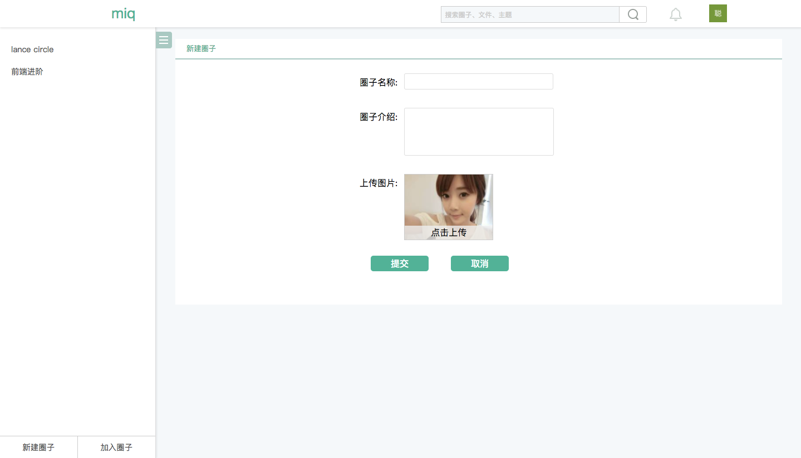

# miq

Hi, all!

That's miq!

[👉 Visit it](http://miq.lancelou.com/)

## What's miq

miq是我最近在鼓弄的一个小项目，前后端JavaScript。PM2做node服务(进程)管理。前端React + Redux，后端Koa，用户账号功能采用Google 和 Github oauth。数据库MySql。目前依旧在开发过程中。

## Tech

**->PM2:** P(rocess) M(anager), Node 进程管理，负载均衡！

PM2于我的项目中所解决的一些问题:

1. 针对Node业务代码单线程，对退出进程进行自动重启。
2. 一些log的记录
3. Keymetrics：可视化界面，远程管理项目，掌握程序当前状态。

**->工程化**

gulp: 工程化入口，task管理，代码压缩，rv，启本地服务，mock server，forward等！

webpack: JavaScript模块化，CSS Module，Babel等！

**->gulp-forward**

自己编写，维护的一个gulp-connect middleware。

主要完成两个任务

* 开发时本地mock
* 测试时取线上数据，本地前端代码
